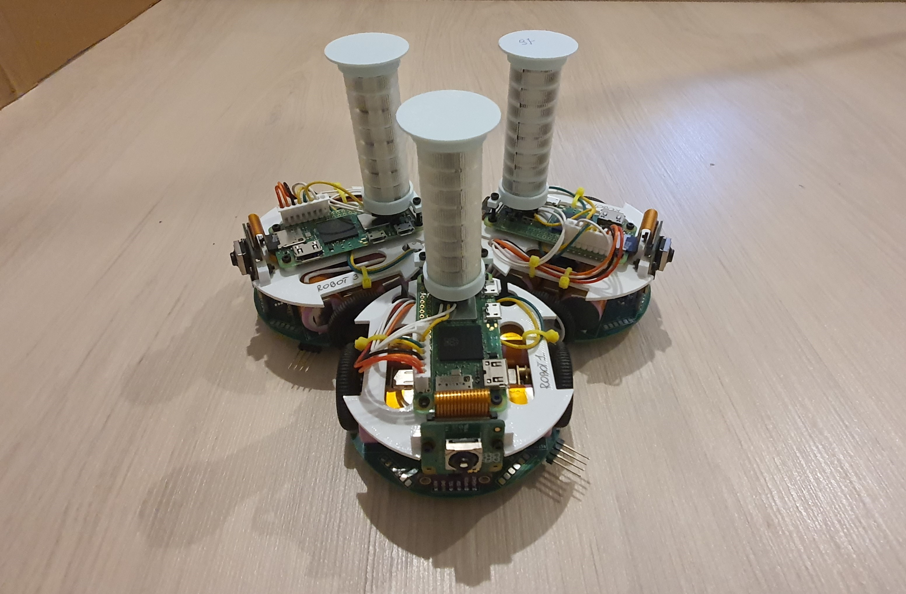

# RoboBond
## Empatyczny rój robotów

| Mobilny rój robotów |
|:-:|
||

### Motywacja
Celem projektu jest opracowanie drugiej generacji empatycznego roju robotów, umożliwiającej przeprowadzanie fizycznych eksperymentów wygodniej, szybciej i na szerszą skalę. Celem badawczym jest analiza algorytmów sztucznej empatii na zminiaturyzowanej generacji roju robotów.

### Opis
Projekt "Rój Empatycznych Robotów" polega na stworzeniu zaawansowanej grupy robotów, która będzie zdolna do interakcji i współpracy, odzwierciedlając przy tym podstawowe instynkty ludzkie, aby efektywnie rozwiązywać zadane problemy. Przyjęcie perspektywy innej osoby i próba zrozumienia jej punktu widzenia znaczenie poprawia współpracę oraz wpływa na osiągnięte wyniki. Roboty dzięki modułowi sztucznej empatii, będą mogły podejmować decyzje w oparciu o stan sąsiednich robotów, pozwala to na stworzenie bardziej efektywnych strategii i szybsze osiągnięcie globalnego celu.

Do przeprowadzenia eksperymentów walidujących użycie algorytmów sztucznej empatii, stworzone zostały dwa symulatory oraz fizyczna platforma mobilnych robotów.

### Zastosowania
- Platforma badawcza dla naukowców do weryfikacji nowych algorytmów sztucznej empatii,
- Środowisko dla nauczycieli wspierające dydaktykę z zakresu sztucznej inteligencji,
- Infrastruktura do testowania nowych ścieżek automatyzacji i robotyzacji w przedsiębiorstwach,
- ... oraz wiele innych.

### Zawartość
W repozytorium znajdują się:
- Symulatory
    - `simulators/RL_ROS_Robots`
    - `simulators/Simpathy`
- Projekt mobilnych robotów
    - `kicad_workspace/bottom` - schemat elektroniczny PCB oraz opis konstrukcji
    - `code/STM32` - kod źródłowy dolnego niskopoziomowego mikrokontrolera robota
    - `code/PI` - kod źródłowy implementujący scenariusz empatyczny 
    - `cad_models` - modele 3d części robota