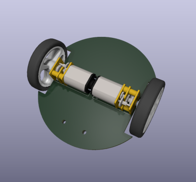
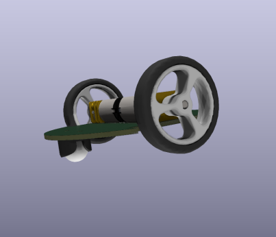

# Empatyczny robot, iteracja druga

## Wymagania
- **Konstrukcja**
Robot będzie miał średnicę około 8 cm. Będzie złożony z dwóch płytek PCB, połączonych w 'kanapkę'. Dolna płytka (STM32 lub AVR) będzie odpowiadała za sterowanie silnikami itp, a górna (Rpi) od obliczenia i obsługę kamery.
Pojazd będzie wyposażony w krańcówki (switch) (około cztery sztuki) wokół swojej obudowy, aby wykrywać zderzenia z otoczeniem.

| Bok | Góra |
| -------- | -------- |
|  |  |

- **Sterowanie**
Za sterowanie czujnikami, silnikami itp. będzie odpowiedzialny mikrokontroler STM32 lub AVR. Z kolei za obsługę kamery będzie odpowiadał moduł Rasberry Pi Zero v2.

- **Napęd**
Robot będzie poruszał się z wykorzystaniem silników DC z enkoderami, aby umożliwić dokładne pomiary pojazdu. Niezbędny do tego będzie również sterownik silników, który w raz z enkoderami będzie sterowany przez STM. Dobór odpowiedniego przełożenia silnika wymaga ustalenia z jaką prędkością powinien poruszać się robot.

| Koła | Tylne koło | Silnik z enkoderem |
| -------- | -------- | -------- |
|  |  |  |

- **Kamera**
Kamera będzie osadzona statycznie przy wieży LED. Serwomechanizm dodaje niepotrzebną złożoność, robot może obrócić się cały, aby wykonać zdjęcie.

- **LED**
Wieża LED oparta będzie o diody WS2812B (lub kompatybilne), w ośmiu rzędach, po dwie lub trzy diody.

- **Zasilanie**
Do zasilania pojazdów można zastosować cylindryczną baterie litowo jonową 18650 osadzoną w środku wieży LED, lub baterię litowo polimerową. W obu przypadkach wymagany będzie jeszcze układ ładowania ogniwa.
Aby uzyskać napięcie zasilania 5V, należy zastosować przetwornicę. Możliwości są dwie: 
    - przetwornica podwyższająca napięcie
        - niższa sprawność
        - jedno ogniwo, stąd prostszy układ ładowania ogniw
    - przetwornica obniżająca napięcie
        - wyższa sprawność
        - dwa lub więcej ogniw, bardziej skomplikowany układ ładowania

| | Li-ion 18650 | Li-Po |
| -------- | -------- | -------- |
| Zalety   | Wydajność prądowa (nawet 30A) | Wydajne prądowo ogniwa są zazwyczaj duże |
| Zalety   | Tania | Gotowe zabezpieczenie przeciw rozładowaniu |
| Zalety   | Prosta wymiana w razie potrzeby | Płaska |
| Wady     | Podwyższa środek ciężkości | Trudno dostępna o wymaganych parametrach |
| Wady     | Wymaga modyfikacji wieży | Wymiary ograniczają możliwości |
| Wady     | Wymaga dodatkowego układu zabezpieczającego | - |

| Li-ion 18650 | Li-Po |
| -------- | -------- |
|  |  |

- **Ładowanie**
Do ładowania robotów zostaną wykorzystane pady kontaktowe, które będą w odpowiedni sposób wykrywane przez pojazdy. Do wypozycjonowania pojazdu względem padów można zastosować magnesy neodymowe, które naprowadzą robota wprost na pady. Pady kontaktowe mogłyby znajdować się pod obudową lub na jej boku.

- **Wybudzanie**
Mikrofon ultradźwiękowy, który ma ne celu wybudzenie robotów z trybu uśpienia. Jedna zewnętrzna płytka na arenie (np. ESP32/8266) będzie na stałe podłączona do internetu i będzie wyposażona w głośnik na ultradźwięki. Po otrzymaniu informacji po WiFi, wyemituje ona dźwięk, który wybudzi STM przez mikrofon, który z kolei wybudzi Rpi.
W przypadku niepowodzenia, można zastosować diody i fototranzystory/odborniki IR. 

- **Czujniki**
Warto wyposażyć robota w dodatkowe czujniki: *żyroskop*, *kompas* i *akcelerometr*. Umożliwią one dokładniejsze odnajdowanie się robota w przestrzeni.

