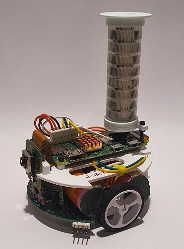
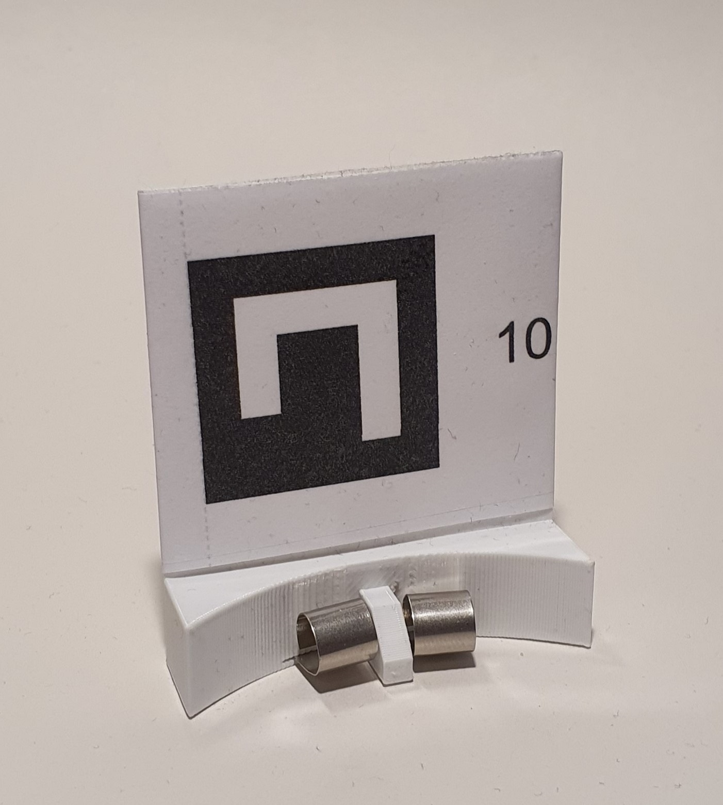
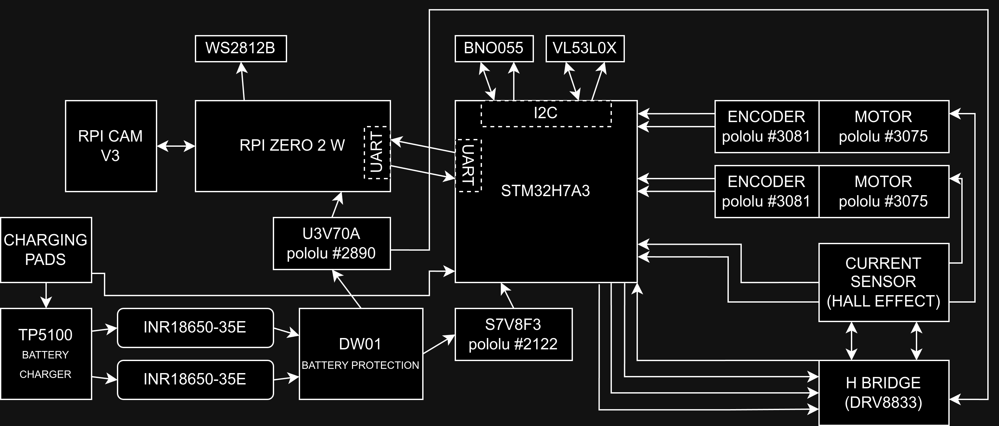
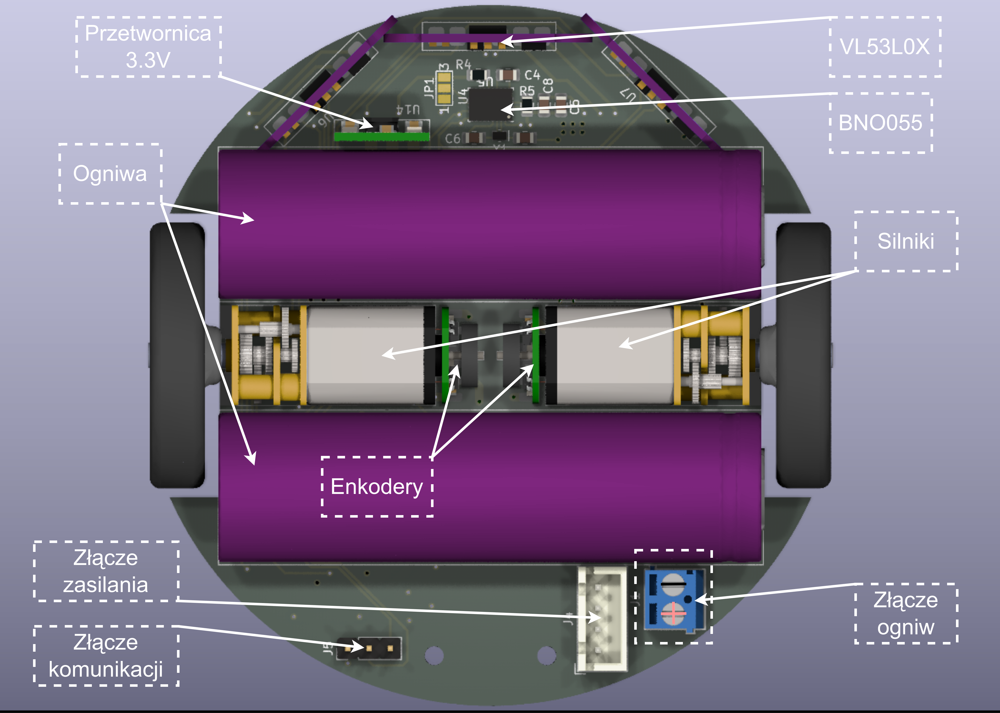

- Dokładny opis budowy robota, szczegółowy, z rysunkiem, repozytorium kodu, częściami (Konrad)
- Opis systemu znajdującego się na robocie (wraz z kodem) z opisem dokładnym, co robot może teraz zrobić (Konrad)
- Opis w jaki sposób łączymy się za pomocą komputera z robotem, protokoły, czy mamy podgląd z robota (jak nie to musimy
  go zaimplementować), zestaw "zakomentowanych?" parametrów stanowiących "scenariusze" (konrad)
- Opis istniejącego systemu wizyjnego (konrad)



# 0. Wstęp
Aktualne kody źródłowe znajdują się [tutaj](https://github.com/kpierzynski/MiniEmpathiaBot)

Wersja projektu PCB płytki, która została fizycznie wykonana w ramach projektu Empatycznych Robotów znajduje się w `tag'u` [tutaj](https://github.com/kpierzynski/MiniEmpathiaBot/archive/refs/tags/v1.0_pcb.zip)

# 1. Budowa

## Opis

Ze względu na minimalizację wymiarów robota, jego konstrukcja przewiduje dwie połączone nad sobą płytki drukowane. Dolna
płytka będzie odpowiedzialna za interakcję z otoczeniem, a górna, za przetwarzanie informacji i podejmowanie decyzji.

Poruszanie się robota w przestrzeni będzie realizowane przy pomocy dwóch miniaturowych silników z przekładniami firmy
Pololu. Każdy z nich wyposażony jest w enkoder magnetyczny na bazie czujników efektu Hall’a TLE4946-2K, specjalnie
zaprojektowanych do tego scenariusza. Obrót silników może być nadzorowany przez czujniki prądu, jeden na każdy silnik,
aby uzyskać dokładne sterowanie momentem silników. W celu wyeliminowania strat na typowych czujnikach prądu z shunt
resistor, można użyć układu, który mierzy prąd w oparciu o efekt Hall’a. Przykładem takiego sensora jest ACS712,
natomiast jest on obecnie nieobsługiwany w oprogramowani dolnej płytki. Do zasilania silników jako układ wykonawczy
zostanie wykorzystany DRV8833. Ten sterownik umożliwia obsługę dwóch silników i charakteryzuje się tym, że wymaga
jedynie dwóch linii sterujących na silnik do regulacji prędkości i kierunku obrotu, a także jest prosty w obsłudze za
pomocą sprzętowych Timer'ów w mikrokontrolerze.

Aby zapewnić robotowi precyzyjną orientację w terenie, zostanie wyposażony w zintegrowany układ BNO055, składający się z
akcelerometru, żyroskopu oraz magnetometru firmy Bosch. Układ ten może wspomagać algorytmy ruchu robota, aby osiągnąć
maksymalną precyzję jego manewrów, natomiast jest on obecnie nieobsługiwany przez oprogramowanie dolnej płytki.
Dodatkowo, sensory VL53L0X dostarczą informację o odległości przeszkód znajdujących się przed robotem. Zastosowanie tych
sensorów wprowadza zwiększoną złożoność zarówno konstrukcji płytki, jak i algorytmów sterujących w porównaniu do
tradycyjnych przycisków i krańcówek. Niemniej jednak ta zmiana przyczynia się do redukcji kontaktu mechanicznego z
otoczeniem, co przekłada się na zminimalizowanie ryzyka uszkodzeń robota i zwiększenie jego niezawodności.

Do zasilania robota zostaną wykorzystane dwa ogniwa litowo-jonowe INR18650-35E firmy Samsung o łącznej pojemności 7Ah.
Ze względu na niewielkie rozmiary robota, w projekcie zostaną wykorzystane cylindryczne ogniwa zamiast płaskich baterii
litowo-polimerowych, co wiąże się z koniecznością dodania układów zabezpieczających. Aby zapewnić bezpieczne zarządzani
energią, zostanie wykorzystany układ ochrony baterii DW01 w połączeniu z tranzystorami wykonawczymi. Ten układ ma za
zadanie monitorować napięcie baterii, aby nie przekroczyła dopuszczalnego zakresu oraz odłączać napięcie w przypadku
wystąpienia zwarcia. Proces ładowania będzie nadzorowany przez układ TP5100, który nie tylko dostarczy do dwóch amperów
prądu, ale także zapewni, że proces ładowania ogniw przebiegnie zgodnie ze specyfikacją ładowania metodą constant
current constant voltage (CC CV). Jednym z założeń projektu jest możliwość ładowania robota bez ingerencji człowieka.
Aby to osiągnąć, na spodzie dolnej płytki drukowanej umieszone zostaną dwa pady kontaktowe. Przy ich użyciu, robot
mógłby po najechaniu na specjalną stację, ładować baterie.

Robot, pomimo niewielkich rozmiarów, będzie wyposażony w układy wymagające dużego poboru prądu. Aby sprostać ich
oczekiwaniom, w projekcie zastosowane będą dwie przetwornice. Jedną o napięciu wyjściowym 5V – U3V70A, która jest w
stanie podać do 10A w szczycie zapotrzebowania nawet przez kilka sekund. Druga przetwornica, tym razem dla układów
zasilanych napięciem 3.3V - U7V8F3 będzie dostarczać prąd dla wszystkich czujników oraz mikrokontrolera. Warto
zaznaczyć, że przetwornica 3.3V będzie pracować w dwóch trybach: step-down, gdy bateria będzie naładowana i step-up, gdy
bateria będzie bliższa rozładowaniu.

Na dolnej płytce umieszczony będzie również 32-bitowy mikrokontroler z rodziny STM32. Wysoka moc obliczeniowa,
elastyczność i popularność pozwoli na implementację niemal dowolnie skomplikowanych algorytmów. Będzie on kontrolować
wszystkie powyższe układy oraz komunimować się z głównym procesorem robota.

Rolę mózgu urządzenia będzie pełnić Raspberry Pi Zero 2 W, jest to czterordzeniowy, jednopłytkowy komputer umieszczony
na górnej płytce, który z pomocą kamery Raspberry Pi Cam V3 będzie reagować na swoje otoczenie i inne roboty. Wszystkie
algorytmy sztucznej inteligencji i empatii będą realizowane właśnie na tym mikrokomputerze. Sygnalizacja własnego
wewnętrznego stanu będzie osiągana przez indywidualnie adresowalne diody RGB - WS2812B, ułożone w 8 rzędów, każdy po 3
diody.

### Górna płytka składa się z:

- płytki `Raspberry Pi Zero 2 W`, na której znajduje się procesor przetwarzający obraz z kamery oraz uruchamia
  empatyczny kod;
- kamery `Raspberry Pi Cam v3`;
- `wieżyczki` komunikacyjnej, opartej na trzech listwach diod `WS2812B`, ułożonych do siebie tyłem. W ten sposób tworzą
  wieżyczkę z 8 rzędami, zdolnymi wyświetlać `RGB`;
- taśmy łączącej kamerę z `Rasbperry Pi`;
- złączem i wtyczką (z przewodami), służą one do połączenia z `dolną` płytką.

Zadaniem `górnej` płytki jest komunikacja z innymi robotami za pomocą `kamer` i `wieżyczek`, oraz wyświetlanie własnego
stanu za pomocą `wieżyczki`. Ponadto wykonywuje ona kod, który podejmuje decyzję na temat działań robota.

### Dolna płytka składa się z:

- mikrokontrolera STM `STM32H7A3`, który odpowiedzialny jest za sterowanie silnikami, odbieranie danych z czujników i
  komunikację z `górną` płytką;
- układu `DRV8833` - wykonawczy układ sterowania silnikami;
- dwóch układów `ACS712`, czujnikami poboru prądu przez silniki. (obecnie nie są one wykorzystywane);
- dwóch ogniw `INR18650-35E` (baterie zasilające robota);
- układu `TP5100` - ładowarki do ogniw;
- układu `DW01` wraz z czterema tranzystorami `8205A` typu MOSFET;
- przetwornicy `U3V70A` lub `U3V70F5` (w zależności od dostępności) - służy do zasilania silników, czujników oraz
  `górnej` płytki;
- prztwornicy `U7V8F3` do zasilania mikrokontrolera `STM` oraz czujników;
- czujnika `VL53L0X` oferujący laserowy pomiar odległości;
- dwóch silników `N20 100:1 HPCB 6V z wydłużonym wałem` (można wybrać nieznacznie inne przełożenie przekładni);
- dwóch enkoderów magnetycznych do oceny kierunku oraz prędkości obrotowej silników;
- modułu `BNO055` - układ zawierający akcelerometr, żyroskop i magnetometer (obecnie nieużywany);
- wyłącznika, odcinającego ogniwa od reszty układów;
- dwóch głównych kół oraz kółko tylne, wspierające stabilność;
- przewodów, wtyczek i złącz;
- kondensatorów, rezystorów i tym podobnych elementów pasywnych;
- autorskiej płytki `PCB`, która łączy elektrycznie wszystkie powyższe elementy.

Zadaniem `dolnej` płytki jest kontrola silników, odbiór danych z czujników oraz nasłuchiwanie komend z `górnej` płytki
oraz informowanie jej o stanie czujników.

### Ładowanie
Ładowanie odbywa się poprzez przyłożenie prądu poprzez pady kontaktowe od spodu dolnej płytki, o parametrach 5V i minimum 2.1A. Należy pamiętać, że robot musi być wtedy włączony (natomiast sama płytka `Raspberry Pi Zero 2 W` może zostać wyłączona poprzez komendę `shutdown now` wysłaną z terminala.). Dla ułatwienia, przygotowany został prosty projekt ładowarki, na którą można nałożyć robota:


### Uwagi
- Odwrotne połączenie baterii do złącza dolnej płytki skutkuje uszkodzeniem robota
- Odwrotne przyłożenie napięcia zasilania do padów ładujących może skutkować uszkodzeniem robota
- Warto przyłożyć mały wiatraczek w pobliżu robota podczas jego ładowania (opcjonalne, ale zalecane)
- Podłączenie zasilania poprzez złącze `USB` na płytce `Raspberry Pi` może skutkować uszkodzeniem tej płytki, jak i całego robota
- Wyłączenie robota przełącznikiem, bez wcześniejszego programowego wyłączenia `Raspberry Pi` (z poziomu konsoli) może skutkować uszkodzeniem plików na karcie mikro SD i wymagać będzie ponownego wgrania systemu operacyjnego
- Pierwsze uruchomienie programu robota może skutkować niekontrolowanym ruchem silników, należy wtedy zewrzeć piny GND i NRST złącza programowania
- Jeśli robot się nie porusza, mimo poprawie włączonego programu, można przeprowadzić reset poprzez zwarcie pinów GND i NRST
- Uruchomienie programu do kontroli wieżyczki i programu głównego na raz można osiągnąć poprzez zastosowanie programu `tmux` [wiki](https://en.wikipedia.org/wiki/Tmux) 
- Układ zabezpieczający ogniwa bywa czasem `nadgorliwy` i jeśli po włączeniu robota przełącznikiem nie włącza się, należy go wyłączyć i włączyć ponownie

## Schematy

Schemat ideowy architektury `dolnej` płytki:
---

---

---

---

## BOM (bill-of-material)

Wykaz potrzebnych układów scalonych:

`górna` płytka:

- 1x Raspberry Pi Zero 2
  W [przykład](https://botland.com.pl/moduly-i-zestawy-raspberry-pi-zero/20347-raspberry-pi-zero-2-w-512mb-ram-wifi-bt-42-5056561800004.html)
- 1x Raspberry Pi Camera
  V3 [przykład](https://botland.com.pl/kamery-do-raspberry-pi/22478-raspberry-pi-camera-hd-v3-12mpx-oryginalna-kamera-do-raspberry-pi-5056561803241.html)
- 1x Taśma
  kamery [przykład](https://botland.com.pl/tasmy-ffc-i-obudowy-do-kamer-do-raspberry-pi/8764-adapter-do-kamery-dla-raspberry-pi-zero-150mm-5904422372613.html)
- 1x Karta Micro SD na system do `Raspberry Pi`, minumum
  16gb [przykład](https://botland.com.pl/karty-pamieci-microsd-sd/17091-karta-pamieci-sandisk-microsd-32gb-80mbs-klasa-10-system-raspberry-pi-os-5903351247771.html)
- 3x Listwa LED
  WS2812 [przykład](https://botland.com.pl/lancuchy-i-matryce-led/6255-listwa-led-rgb-ws2812-5050-x-8-diod-53mm-5903351249157.html)
- 1x Listwa goldpin kątowa 2.54 (listwa 40 goldpinów kątowych starczy na 9
  robotów) [przykład](https://allegro.pl/oferta/wtyk-goldpin-1x40-katowy-raster-2-54mm-5-sztuk-15595405288)
- 1x Listwa goldpin prosta 2.54 (listwa 40 goldpinów prostych starczy na 3
  roboty) [przykład](https://allegro.pl/oferta/goldpin-listwa-prosta-1x40-2-54mm-2szt-7845727129)

`dolna` płytka:

- 1x Para kół
  POLOLU-1087 [przykład](https://botland.com.pl/kola-z-oponami/12-kola-32x7mm-czarne-pololu-1087-5903351247924.html)
- 1x Tylne koło
  POLOLU-951 [przykład](https://botland.com.pl/kulki-podporowe/63-ball-caster-38-metalowy-pololu-951-5904422362690.html)
- 1x Komplet enkoderów
  POLOLU-3081 [przykład](https://botland.com.pl/enkodery/4884-zestaw-enkoderow-magnetycznych-do-micro-silnikow-pololu-kompatybilne-z-hpcb-27-18v-2-szt-pololu-3081-5904422309763.html)
- 2x Silnik N20 6V 100:1, koniecznie z obustronnym wałem
  POLOLU-3075 [przykład](https://botland.com.pl/silniki-dc-micro-z-przekladnia/5095-silnik-hpcb-1001-obustronny-wal-pololu-3075-5904422306250.html)
- 1x Przetwornica 5V U3V70A POLOLU-2890 lub U3V70F5
  POLOLU-2891 [przykład 1](https://botland.com.pl/przetwornice-step-up/14009-u3v70a-przetwornica-step-up-regulowana-45-20v-10a-pololu-2890-5904422308278.html) [przykład 2](https://botland.com.pl/przetwornice-step-up/14003-u3v70f5-przetwornica-step-up-5v-10a-pololu-2891-5904422342333.html)
- 1x Przetwornica 3.3V
  S7V8F3 [przykład](https://botland.com.pl/przetwornice-step-up-step-down/1427-s7v8f3-przetwornica-step-up-step-down-33v-1a-pololu-2122-5904422373092.html)
- 2x Ogniwa INR18650-35E z
  blaszkami [przykład](https://allegro.pl/oferta/akumulator-li-ion-3-6v-3500mah-35e-18650-samsung-jakar-14648140021)
- 1x Moduł ładowania
  TP5100 [przykład](https://allegro.pl/oferta/ladowarka-bms-tp5100-1s-2s-4-2v-8-4v-2a-li-ion-12807445915)
- 1x Układ zabezpieczający
  DW01 [przykład](https://allegro.pl/oferta/uklad-scalony-dw01a-sot23-ochronna-baterii-litowej-14329551443)
- 4x MOSFET wykonawczy 8205A (w obudowie TSSOP8) (najprościej pozyskać z
  wylutu) [przykład](https://allegro.pl/oferta/modul-bms-1s-12a-15a-li-ion-18650-3-7v-ladowarka-8727193369)
- 1x BNO055 !opcjonalny, aktualnie
  niewykorzystywany! [przykład](https://www.mouser.pl/ProductDetail/Bosch-Sensortec/BNO055?qs=QhAb4EtQfbV8Z2YmISucWw%3D%3D)
- 3x VL53L0X !dwa są opcjonalne, aktualnie
  niewykorzystywane! [przykład](https://allegro.pl/oferta/czujnik-odleglosci-vl53l0x-laser-technologia-tof-11615057637)
- 1x Złącze ARK 3.5mm 2-pinowe
  gniazdo [przykład](https://allegro.pl/oferta/zlacze-ark-3-5-2-pin-do-druku-250v-10a-5-sztuk-16363325265)
- 1x
  Wyłącznik [przykład](https://allegro.pl/oferta/przelacznik-dzwigienkowy-1a-3-pin-2-pozycje-0924-10562437231?fromVariant=11672438745)
- 1x Złącze JST-XH 4-pinowe gniazdo

- 2x ACS712-05B (wersja do 5A) !opcjonalny, aktualnie niewykorzystywany! (obudowa
  SOIC8) [przykład](https://allegro.pl/oferta/modul-ukladu-czujnika-halla-acs712-5a-pcb-pomiar-pradu-z-esp-arduino-avr-16710090918?bi_s=ads&bi_m=productlisting:desktop:query&bi_c=ODU4NWNmNjctMjE2Zi00MWEwLTgzOTgtZjJkNzNhNDJmMzRmAA&bi_t=ape&referrer=proxy&emission_unit_id=785e9423-45ac-47dd-8248-a119138c1530)
- 1x DRV8833PWP (obudowa HTSSOP-16) [przykład](https://www.mouser.pl/ProductDetail/595-DRV8833PWP)
- 1x STM32H7A3RIT6 (obudowa LQFP64) [przykład](https://www.mouser.pl/ProductDetail/511-STM32H7A3RIT6)

- 2x Kondensator 0805 22pF (niepotrzebny, jeśli brak BNO055)
- 1x Kondensator 0805 120nF (niepotrzebny, jeśli brak BNO055)
- 13x Kondensator 0805 100nF
- 4x Kondensator 0805 1uF
- 3x Kondensator 0805 2.2uF
- 2x Kondensator 0805 10nF
- 1x Kondensator 0805 10uF
- 1x Kondensator tantalowy 100uF (około, ale lepiej więcej) 6.3V minimum, obudowa B (1411)

- 1x Dławik ferrytowy 0805 470nH (około)

- 2x Rezystor 0805 0R (4x jeśli brak ACS712)
- 9x Rezystor 0805 10K
- 1x Rezystor 0805 33K
- 2x Rezystor 0805 5.6K (niepotrzebny, jeśli brak BNO055)
- 1x Rezystor 100R
- 1x Rezystor 1K

ogólne:

- 1x Złącze JST-XH 4-pinowe wtyk
- 1x Złącze JST-XH 8-pinowe wtyk
- 1x Złącze JST-XH 3-pinowe wtyk
- 16x Pin JST-XH
- Przewód połączeniowy ogniw (AWG18-19)
- Przewód połączeniowy złącz JST (AWG22-26, najlepiej 24, najlepiej kilka kolorów)

- 1x !jeden zestaw starczy na kilka robotów! Zestaw śrubek
  M2 [przykład](https://allegro.pl/oferta/zestaw-srub-nakretek-metalowych-m2-420-sztuk-jakar-14384052335)
- cyna 0.56mm +- 0.16mm
- około 10cm taśmy niklowej (do wykonania połączeń przy silnikach)
- około 15cm taśmy niklowej (opcjonalnie) (do wykonania ładowarki)

# 2. Uruchomienie

## `górna` płytka - uruchomienie:

**Do wykonania poniższych kroków niezbędna jest podstawowa znajomość systemu Linux oraz ekosystemu Raspberry**

1. Instalacja systemu `Raspberry Pi OS Lite (64-bit), port Debiana Bookworm`

- Pobierz i uruchom Raspberry Pi Imager ze strony Raspberry Pi.
- Wybierz „Raspberry Pi OS Lite (64-bit)”.
- Wybierz kartę SD i kliknij „WRITE”.
- Skonfiguruj WiFi, zmień nazwę użytkownika i hasło, włącz SSH.
- Po zakończeniu włóż kartę SD do Raspberry Pi.

2. Uruchom `Raspberry Pi` i podłącz się do konsoli po SSH (lub za pomocą monitora przez HDMI i klawiatury przez USB)
3. Po otworzeniu konsoli i zalogowaniu się:

- Zaktualizuj listy pakietów i zainstaluj aktualizacje dla już zainstalowanych pakietów:

```bash
sudo apt-get update
sudo apt-get upgrade
```

- Zmień rozmiar przestrzeni wymiany (swap) na „Raspberry Pi Zero 2 W”, który ma ograniczoną pamięć RAM:
    * Edytuj plik `/etc/dphys-swapfile`, aby zwiększyć rozmiar swap do `2048 MB`.
    * Zrestartuj `Raspberry` za pomocą `sudo reboot`.
- Włącz interfejs szeregowy na Raspberry Pi, aby móc komunikować się z silnikami sterowanymi przez mikrokontroler STM32
  w dolnej części robota. Użyj narzędzia `raspi-config` do konfiguracji ustawień.
- Zainstaluj niezbędne pakiety systemowe:

```bash
sudo apt-get install curl git python3 python3-pip python3-venv python3-libcamera btop tmux libpcap-dev python3-full
sudo apt-get install python3-picamera2 --no-install-recommends
```

- Utwórz wirtualne środowisko Pythona:

```bash
python3 -m venv --system-site-packages VENV
```

**Uwaga na parametr `--system-site-packages`**

- Używając świeżo utworzonego środowiska venv, zainstaluj moduły:

```bash
VENV/bin/python3 -m pip install adafruit-circuitpython-neopixel pyserial opencv-contrib-python
```

- Część kodu sterującego diodami LED: `WS2812` wymaga niskopoziomowego dostępu do rejestrów procesora, dlatego wymaga
  dostępu sudo. Z tego powodu diody LED są sterowane przez osobny program komunikujący się za pomocą gniazda (`AF_UNIX`
  typ do komunikacji międzyprocesowej w systemach podobnych do Unix). Aby uruchomić serwer LED:

```bash
sudo VENV/bin/python neo_server.py
```

**Uruchomienie podprogramu do obsługi diod LED oraz głównej części aplikacji wymaga dwóch terminalów, można skorzystać
z `tmux`.**

- Aplikacja jest gotowa do uruchomienia:

```bash
VENV/bin/python3 main.py
```

## `dolna` płytka - uruchomienie:

1. Pobierz `STM32CubeIDE` w wersji
   `1.15.0` [link](https://www.st.com/en/development-tools/stm32cubeide.html#get-software)
2. Zainstaluj `IDE` zgodnie z krokami instalatora
3. Do skompilowania projektu potrzebna jest również biblioteka `CMSIS` w wersji
   `5.7.0` [dostępna tutaj](https://www.keil.com/pack/ARM.CMSIS.5.7.0.pack)

- W oknie `IDE` przejdź do `Help`, dalej wybierz `Manage Embedded Software Packages`, następnie przycisk `From Local...`
  i wybierz wyżej pobrany pakiet `CMSIS`.

4. Otwórz projet i wgraj go na mikrokontroler `STM` za pomocą padów wyprowadzonych na krawędzi `dolnej` płytki.

- Do zaprogramowania potrzebne są połączenia czterech przewodów między `STM` a programatorem:
    * NRST
    * SWDIO
    * GND
    * SWCLK
- Należy użyć oryginalnego programatora `ST-link` od firmy `ST`

Dolna `płytka` komunikuje się z `górną` przy pomocy protokołu `UART` w konfiguracji `115200 8n1`, oczekuje ona nastawy
prędkości silników w następującej postaci:

```uart
LsXYZsXYZ
```

, gdzie `L` to dosłownie litera L oznaczająca, że następne dane konfigurują silnik L (analogicznie `R`), `s` to znak (
kierunek) obrotu silnika ze zbioru `+-`, a XYZ to trzy cyfrowa liczba oznaczająca prędkość dla danego silnika

# 3. Łącznie z `górną` płytką

W obecnej chwili zarządzanie robotem odbywa się za pomocą konsoli Linux, do której podłączenie odbywa się przy pomocy
branżowego standardu poprzez protokuł `SSH`. Nazwa użytkownika ustalana jest w pierwszyk kroku podczas instalacji
systemu `Raspberry Pi OS Lite (64-bit), port Debiana Bookworm` w `Raspberry Pi Imager`. Analogicznie do nazwy
użytkownika, w `Imager` ustawiane jest hasło do tego użytkownia jak i parametry sieci `WiFi` do której ma łączyć się
robot. Wywołanie `SSH` może wyglądać następująco:

```bash
ssh [robot_username]@[robot_ip]
```

, gdzie `[robot_ip]` należy odnaleźć przy użyciu ustawień routera, do którego łączyć się będzie robot, lub programu typu
`Advenced Ip Scanner`.

# 4. System wizyjny

## Wieżyczki

(`detect_tower.py`)

System wizyjny jest rozwiązany w oparciu o bibliotekę `OpenCV`. Rozpoznawane są trzy typy wieżyczek:
`całkowicie czerwone`, `całkowicie zielone` oraz `całkowicie niebieskie`. Algorytm wykrywania działa w oparciu o
poniższe, główne kroki:

1. Pobranie z modułu kamery aktualnej ramki z obrazem
2. Podział ramki na trzy podramki (maski), wydzielając z obrazu trzy podstawowe kolory w oparciu o arbitralnie wybrane
   wartości graniczne (zdefiniowane w `detect_tower.py` jako zmienna słownikowa `hsv_ranges`)
3. Tak przefiltrowane względem intensywności koloru maski są łącznone w jedną ramkę
4. Na ramce wykonywane są operacje wykrywania wieżyczek
    * odrzucane są zbyt małe kształty, mało prawdopodobne kształy
    * wykonywane jest rozmycie ramki, aby wygładzić ostre filtrowanie z kroku 2.
5. Wieżyczki są zliczane i zapisywane do dalszego przetwarzania

Rozwiązanie to jest niestety podatne na zmienne warunki oświetlenia oraz ze względu na proces przetwarzania, podatne na
rozpoznawanie innych przedmiotów jako wieżyczki, natomiast wykonywane jest szybko, mimo niezbyt imponującej mocy
obliczeniowej procesora.

## ArUco

(`detect_aruco.py`)

Jako znacznik celu, wykorzystane są znaczniki ArUco, przypominające popularne QRCode. Ich przewagą jest możliwość (
relatywnie) prostego określenia odległości, rotacji i ich przesunięcia względem robota.

Aby osiągnąć dokładny pomiar odległości, należy wcześniej przeprowadzić kalibrację kamery i w efekcie odnaleźć macierz
kamery oraz współczynniki zniekształcenia. Macierz ta, jak i współczynniki są już znalezione i są w pliku `Camera.py`.
Warto zauważyć, że macierz jaki i współczynniki są różne, dla różnych kamer i rozdzielczości. Ponadto, rozmiar użytych
kodów musi być podany wcześniej w `detect_aruco.py` w zmiennej `marker_length` w metrach. Domyślnie `0.0355m` czyli
`3.55cm`.

Algorytm rozpoznawania ArUco z kamery działa następująco:

1. Wczytanie ramki z modułu kamery
2. Przekazanie jej do OpenCV solvera, które znajdzie kody na zdjęciu oraz określi ich przekształcenia i odległość na
   podstawie macierzy i wspólczynników kamery.
3. Przeliczenie odległości na `cm` oraz zapisanie każdego znalezionego kodu do dalszego przetwarzania.

# 5. Działanie

Program obecnie składa się z kroku inicjalizacji oraz pętli głównej.
W kroku inicjalizacji przygotowywane są komponenty:

- inicjalizacja listy wektoróœ celu
- inicjalizacja kamery wraz z parametrami (rozdzielczość 1280x720, obrót horyzontalny o 180 stopni)
- inicjalizacja modułu `UART` do komunikacji z `dolną` płytką
- inicjalizacja klienta, który łączy się z serwerem diod LED wieżyczki
- inicjalizacja stanu wewnętrznego robota

Dalej, w pętli głównej wykonywane są kroki:

1. Pobranie ramki z modułu kamery
2. Odebranie z `dolnej` płytki informacji o odległości robota od najbliższej przeszkody (na podstawie laserowego
   czujnika odległości VL53L0X)
3. Uruchomienie przetwarzania detekcji ArUco kodów na podstawie ramki z kamery
    * Uaktualnienie stanu robota o informacje o znajdujących się (lub nie) w pobliżu kodów ArUco
4. Uruchomienie przetwarzania detekcji wieżyczej innych robotów
    * Uaktualnienie stanu robota o informacje o otaczających go robotach
5. Ewaluacja wewnętrznego stanu robota względem wektorów celu przy pomocy rozmytej funkcji podobieństwa
    * Odnalezienie najbardziej podobnego wektora do wektora wewnętrznego
    * Sprawdzenie, czy podobieństwo przekracza próg
        - jeśli tak, to podejmowana jest akcja związana z tym wektorem
        - jeśli nie, robot porusza się losowo.

Wektory celu dla scenariusza poszukiwania ArUco wyglądają następująco:

```python
GOALS = {
	"aruco": [1, 0.2, 0.5, 0.5, 1],
	"teamwork": [0, 1, 0.8, 0.8, 0]
}
THRESHOLD = 0.8
```

, gdzie:

| i-ty element | funkcja                                                                                      |
|--------------|----------------------------------------------------------------------------------------------| 
| v_1          | czy robot widzi cel? (0 jeśli nie, 1 jeśli tak)                                              |
| v_2          | dystans do ArUco (w metrach, gdzie wartości >1m są zaokrąglane w dół do 1)                   |
| v_3          | czy robot widzi jakiegoś zielonego robota? (1 jeśli tak, 0 jeśli nie)                        |
| v_4          | czy robot widzi innego niebieskiego robota? (1 jeśli tak, 0 jeśli nie)                       |
| v_5          | czy robot jest aktualnie zielony? (inaczej: czy robot widzi cel?) (1 jeśli tak, 0 jeśli nie) |

Dobierając różne wartości wektorów celu lub/i dodając nowe, można zmienić sposób działania poszczególnych robotów jak i
całego roju.

Akcje, które mają się wykonać po spełnieniu wszystkich warunków dla danej akcji zdefiniowane są na końcu pętli głównej w bloku `match`. W przykładowym kodzie, są dwie akcje związane z dwoma wektorami celu oraz dodatkowa 'domyślna' akcja jeśli żaden z wektorów nie spełni warunków. W przypadku spełnienia wektora celu o nazwie `aruco` robot zapali wieżyczkę na zielono oraz rozpocznie jazdę w kierunku pierwszego kodu. W przypadku akcji wektora `teamwork`, robot zapali się na niebiesko i zacznie podążać do pierwszego znalezionego robota, który widzi cel lub innego robota, który widzi cel. Domyślna akcja powoduje, że robot porusza się losowo po środowisku.
