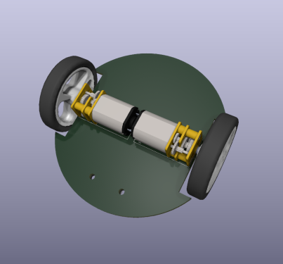

# Empatyczny robot, iteracja druga

## Obecna konstrukcja PCB
Widok gory | Widok spodu
-- | --
 | 

## Architektura robota

Ze względu na minimalizację wymiarów robota, jego konstrukcja przewiduje dwie połączone nad sobą płytki drukowane. Dolna płytka będzie odpowiedzialna za interakcję z otoczeniem, a górna, za przetwarzanie informacji i podejmowanie decyzji. 

Poruszanie się robota w przestrzeni będzie realizowane przy pomocy dwóch miniaturowych silników z przekładniami firmy Pololu. Każdy z nich wyposażony jest w enkoder magnetyczny na bazie czujników efektu Hall’a TLE4946-2K, specjalnie zaprojektowanych do tego scenariusza. Obrót silników będzie dodatkowo nadzorowany przez czujniki prądu, jeden na każdy silnik, aby uzyskać dokładne sterowanie prędkością obrotową. W celu wyeliminowania strat na typowych czujnikach prądu z shunt resistor, można użyć układu, który mierzy prąd w oparciu o efekt Hall’a. Przykładem takich sensorów są ACS712 lub ACS724. Do zasilania silników jako układ wykonawczy zostanie wykorzystany DRV8833. Ten sterownik umożliwia obsługę dwóch silników i charakteryzuje się tym, że wymaga jedynie dwóch linii sterujących na silnik do regulacji prędkości i kierunku obrotu, a także jest prosty w obsłudze za pomocą sprzętowych Timer'ów w mikrokontrolerze. 

Aby zapewnić robotowi precyzyjną orientację w terenie, zostanie wyposażony w zintegrowany układ BNO055, składający się z akcelerometru, żyroskopu oraz magnetometru firmy Bosch. Układ ten będzie wspomagać algorytmy ruchu robota, aby osiągnąć maksymalną precyzję jego manewrów. Dodatkowo, sensory VL53L0X dostarczą informację o odległości przeszkód znajdujących się przed robotem. Zastosowanie tych sensorów wprowadza zwiększoną złożoność zarówno konstrukcji płytki, jak i algorytmów sterujących w porównaniu do tradycyjnych przycisków i krańcówek. Niemniej jednak ta zmiana przyczynia się do redukcji kontaktu mechanicznego z otoczeniem, co przekłada się na zminimalizowanie ryzyka uszkodzeń robota i zwiększenie jego niezawodności. 

Do zasilania robota zostaną wykorzystane dwa ogniwa litowo-jonowe INR18650-35E firmy Samsung o łącznej pojemności 7Ah. Ze względu na niewielkie rozmiary robota, w projekcie zostaną wykorzystane cylindryczne ogniwa zamiast płaskich baterii litowo-polimerowych, co wiąże się z koniecznością dodania układów zabezpieczających. Aby zapewnić bezpieczne zarządzani energią, zostanie wykorzystany układ ochrony baterii DW01 w połączeniu z tranzystorami wykonawczymi. Ten układ ma za zadanie monitorować napięcie baterii, aby nie przekroczyła dopuszczalnego zakresu oraz odłączać napięcie w przypadku wystąpienia zwarcia. Proces ładowania będzie nadzorowany przez układ TP5100, który nie tylko dostarczy do dwóch amperów prądu, ale także zapewni, że proces ładowania ogniw przebiegnie zgodnie ze specyfikacją ładowania metodą constant current constant voltage (CC CV). Jednym z założeń projektu jest możliwość ładowania robota bez ingerencji człowieka. Aby to osiągnąć, na spodzie dolnej płytki drukowanej umieszone zostaną dwa pady kontaktowe. Przy ich użyciu, robot po najechaniu na specjalną stację ładowania będzie mógł ładować baterie. To rozwiązanie jest niezwykle proste, zajmuje niewiele miejsca oraz nie wprowadza strat w przekazywaniu energii. 

Robot, pomimo niewielkich rozmiarów, będzie wyposażony w układy wymagające dużego poboru prądu. Aby sprostać ich oczekiwaniom, w projekcie zastosowane będą dwie przetwornice. Jedną o napięciu wyjściowym 5V – U3V70A, która jest w stanie podać do 10A w szczycie zapotrzebowania nawet przez kilka sekund. Druga przetwornica, tym razem dla układów zasilanych napięciem 3.3V - U7V8F3 będzie dostarczać prąd dla wszystkich czujników oraz mikrokontrolera. Warto zaznaczyć, że przetwornica 3.3V będzie pracować w dwóch trybach: step-down, gdy bateria będzie naładowana i step-up, gdy bateria będzie bliższa rozładowaniu.  

Na dolnej płytce umieszczony będzie również 32-bitowy mikrokontroler z rodziny STM32. Wysoka moc obliczeniowa, elastyczność i popularność pozwoli na implementację niemal dowolnie skomplikowanych algorytmów. Będzie on kontrolować wszystkie powyższe układy oraz komunimować się z głównym procesorem robota. 

Rolę mózgu urządzenia będzie pełnić Raspberry Pi Zero 2 W, jest to czterordzeniowy, jednopłytkowy komputer umieszczony na górnej płytce drukowanej, który z pomocą kamery Raspberry Pi Cam V3 będzie reagować na swoje otoczenie i inne roboty. Wszystkie algorytmy sztucznej inteligencji i empatii będą realizowane właśnie na tym mikrokomputerze. Sygnalizacja własnego wewnętrznego stanu będzie osiągana przez indywidualnie adresowalne diody RGB - WS2812B, ułożone w 8 rzędów, każdy po 3 diody. Umożliwi to wyświetlenie co najmniej półtora miliona różnych stanów. 

## Wstępne rozważania na temat wymagań konstrukcyjnych
- **Konstrukcja**

Robot będzie miał średnicę około 8 cm. Będzie złożony z dwóch płytek PCB, połączonych w 'kanapkę'. Dolna płytka (STM32 lub AVR) będzie odpowiadała za sterowanie silnikami itp, a górna (Rpi) od obliczenia i obsługę kamery.
Pojazd będzie wyposażony w krańcówki (switch) (około cztery sztuki) wokół swojej obudowy, aby wykrywać zderzenia z otoczeniem.

| Góra | Bok |
| -------- | -------- |
|  |  |

- **Sterowanie**

Za sterowanie czujnikami, silnikami itp. będzie odpowiedzialny mikrokontroler STM32 lub AVR. Z kolei za obsługę kamery będzie odpowiadał moduł Rasberry Pi Zero v2.

- **Napęd**

Robot będzie poruszał się z wykorzystaniem silników DC z enkoderami, aby umożliwić dokładne pomiary pojazdu. Niezbędny do tego będzie również sterownik silników, który w raz z enkoderami będzie sterowany przez STM. Dobór odpowiedniego przełożenia silnika wymaga ustalenia z jaką prędkością powinien poruszać się robot.

| Koła | Tylne koło | Silnik z enkoderem |
| -------- | -------- | -------- |
|  |  |  |

- **Kamera**

Kamera będzie osadzona statycznie przy wieży LED. Serwomechanizm dodaje niepotrzebną złożoność, robot może obrócić się cały, aby wykonać zdjęcie.

- **LED**

Wieża LED oparta będzie o diody WS2812B (lub kompatybilne), w ośmiu rzędach, po dwie lub trzy diody.

- **Zasilanie**

Do zasilania pojazdów można zastosować cylindryczną baterie litowo jonową 18650 osadzoną w środku wieży LED, lub baterię litowo polimerową. W obu przypadkach wymagany będzie jeszcze układ ładowania ogniwa.
Aby uzyskać napięcie zasilania 5V, należy zastosować przetwornicę. Możliwości są dwie: 
    - przetwornica podwyższająca napięcie
        - niższa sprawność
        - jedno ogniwo, stąd prostszy układ ładowania ogniw
    - przetwornica obniżająca napięcie
        - wyższa sprawność
        - dwa lub więcej ogniw, bardziej skomplikowany układ ładowania

| | Li-ion 18650 | Li-Po |
| -------- | -------- | -------- |
| Zalety   | Wydajność prądowa (nawet 30A) | Wydajne prądowo ogniwa są zazwyczaj duże |
| Zalety   | Tania | Gotowe zabezpieczenie przeciw rozładowaniu |
| Zalety   | Prosta wymiana w razie potrzeby | Płaska |
| Wady     | Podwyższa środek ciężkości | Trudno dostępna o wymaganych parametrach |
| Wady     | Wymaga modyfikacji wieży | Wymiary ograniczają możliwości |
| Wady     | Wymaga dodatkowego układu zabezpieczającego | - |

| Li-ion 18650 | Li-Po |
| -------- | -------- |
|  |  |

- **Ładowanie**

Do ładowania robotów zostaną wykorzystane pady kontaktowe, które będą w odpowiedni sposób wykrywane przez pojazdy. Do wypozycjonowania pojazdu względem padów można zastosować magnesy neodymowe, które naprowadzą robota wprost na pady. Pady kontaktowe mogłyby znajdować się pod obudową lub na jej boku.

- **Wybudzanie**

Mikrofon ultradźwiękowy, który ma ne celu wybudzenie robotów z trybu uśpienia. Jedna zewnętrzna płytka na arenie (np. ESP32/8266) będzie na stałe podłączona do internetu i będzie wyposażona w głośnik na ultradźwięki. Po otrzymaniu informacji po WiFi, wyemituje ona dźwięk, który wybudzi STM przez mikrofon, który z kolei wybudzi Rpi.
W przypadku niepowodzenia, można zastosować diody i fototranzystory/odborniki IR. 

- **Czujniki**

Warto wyposażyć robota w dodatkowe czujniki: *żyroskop*, *kompas* i *akcelerometr*. Umożliwią one dokładniejsze odnajdowanie się robota w przestrzeni.

