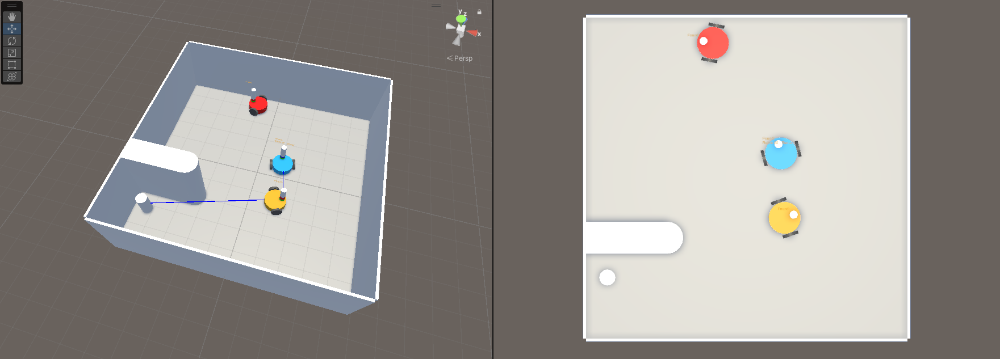

# Simpathy - Simulator

The simulator, developed in Unity, offers an environment for comparing egotistic and empathetic behaviors of two-wheeled robots.

1. Environment: The simulation provides a straightforward arena and a customizable number of robots.
2. Robots: The agents' appearance and movement are modeled after real robots, aiming to mimic their core features. Agents communicate using a virtual camera and a tower constructed with rows of LEDs.
3. Experiments: The simulation features a basic empathetic scenario in which robots attempt to reach a goal cylinder while communicating with each other.

This setup allows for the examination of both egotistic and empathetic behaviors in a controlled virtual environment.

## How to run
1. Install Unity Hub from the Unity website,
2. Install Unity 2022.3.28f1 through Unity Hub,
3. Import project in Unity Hub,
4. Open the project with version 2022.3.28f1 of an engine.

3D Engine: **Unity**, version *2022.3.28f1*

## How to Use
1. Customize the simulation:
    - Main Camera object -> Manager Script
        - Speed: Controls the speed of the simulation for faster results.
    - Robots object -> Robot Spawner Script
        - Robot Prefab: Blueprint of the robot to spawn.
        -  Plane: The object on which robots will spawn, distributed randomly across the bounding space.
        - Robot Count: Number of robots to spawn.
    - Robot Prefab -> Robot Script
        - Egoistic: controls the behavior of a swarm.
2. Press "Play" in Unity's editor.
3. Observe the results.
4. (Optional) Edit the Robot.cs script to change the robots' behavior.